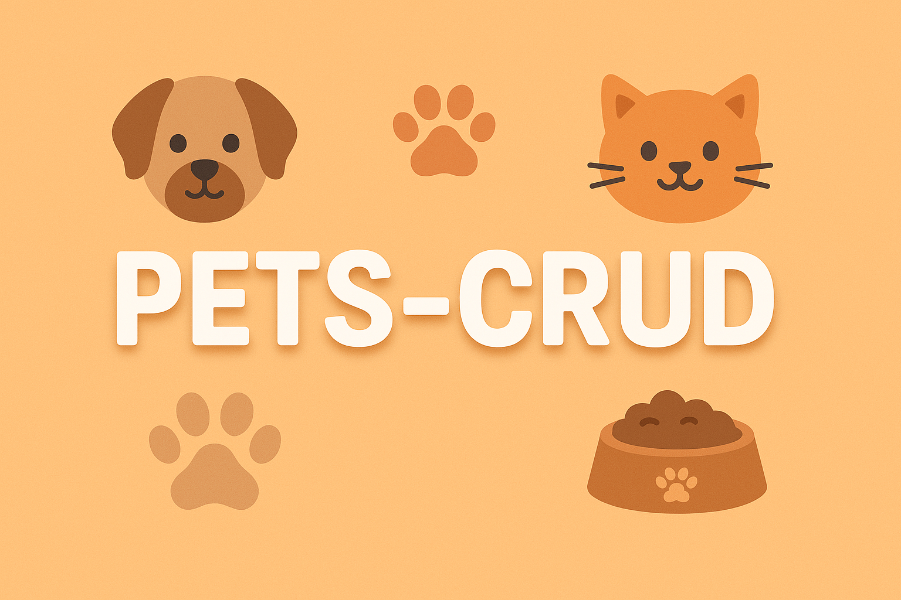
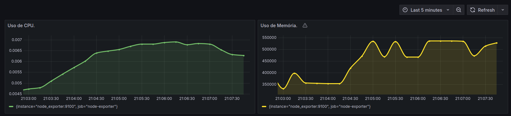

# PETS-CRUD

## ✨ Sobre o Projeto

Este é um projeto de CRUD de Pets que utiliza autenticação com Keycloak e logging assíncrono via RabbitMQ. A API foi construída com foco em segurança, desempenho e rastreabilidade das ações dos usuários.

---

## 🔐 Autenticação

A API utiliza o **Keycloak** para autenticação e cadastro de usuários. Abaixo, um modelo ilustrativo do funcionamento:

---

## 📦 Logs de Requisição

A API implementa um mecanismo de **logging assíncrono** para todas as requisições.

- Um middleware intercepta cada requisição.
- Coleta informações como: método HTTP, endpoint, parâmetros, tempo de resposta e status HTTP.
- Os dados são enviados para uma **fila no RabbitMQ**, permitindo que o processamento da API continue sem bloqueios.

### 📊 Modelo de Funcionamento:

### 💾 Exemplo de Log Armazenado:

Visualização de logs persistidos no banco de dados:

### 🖥️ Logs no Terminal:

Além dos logs persistentes, a API também exibe logs no terminal para facilitar o acompanhamento em tempo real:

## 📈 Monitoramento com Prometheus e Grafana

O projeto conta com **Prometheus** e **Grafana** configurados para monitoramento de métricas da API em tempo real.

- O Prometheus coleta métricas expostas pela aplicação.
- O Grafana exibe essas métricas de forma visual e interativa através de dashboards.

Exemplo de uma dashboard criada no grafana com os dados do prometheus.

---

## 🚀 Como Rodar o Projeto

### Pré-requisitos:

- [Docker](https://www.docker.com/)
- [Yarn](https://classic.yarnpkg.com/lang/en/docs/install/)

### Passos:

1. Clone o repositório:

   git clone https://github.com/seu-usuario/pets-crud.git
   cd pets-crud

2. Suba os container com Docker Compose:
   docker-compose up -d

3. Inicie o servidor de desenvolvimento
   yarn dev
