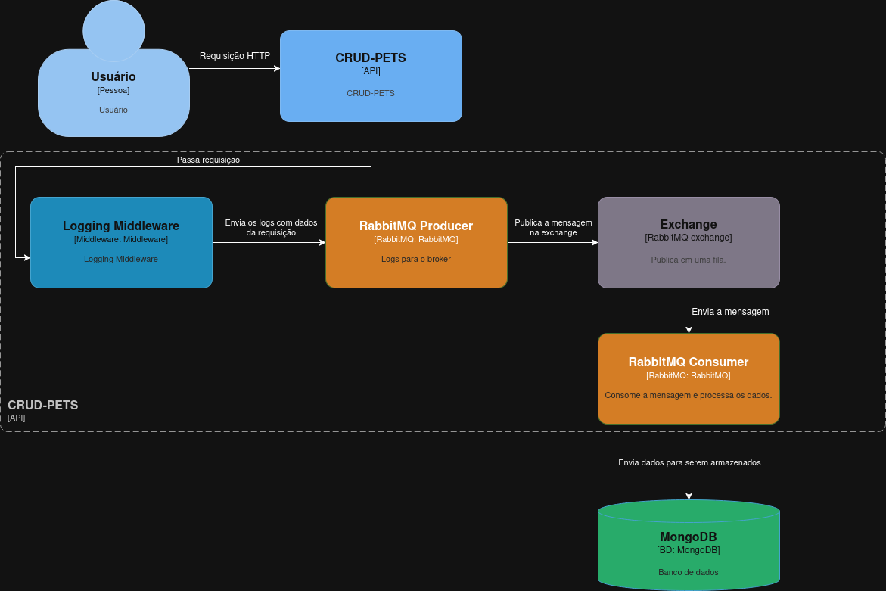
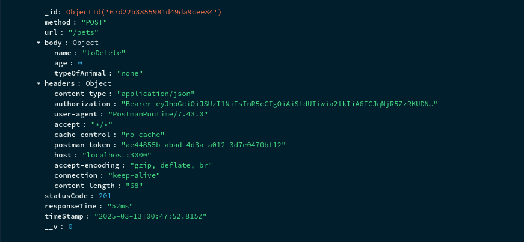
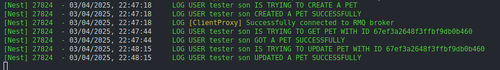

# CRUD-PETS

## AUTENTICAÇÃO

A api usa o KeyCloak para fazer o cadastro de usuários e login dos mesmos.
Modelo para exemplo do funcionamento.

## LOGS DE REQUISIÇÃO

A api implementa um mecanismo de logging assíncrono para todas as requisições. Um middleware intercepta cada requisição, coletando informações relevantes como método HTTP, endpoint, parâmetros, tempo de resposta e código de status. Estes dados são enviados para uma fila no RabbitMQ, permitindo que a API continue atendendo às solicitações sem bloqueio.
Modelo para exemplo de funcionamento.

Segue um exemplo de Log armazenado no banco de dados. Nele, podemos visualizar informações como o tipo de requisição, a data e hora em que ocorreu, o tempo de processamento, entre outros detalhes relevantes.

Além desses logs armazenados no banco a api também conta com logs no terminal para sinalizar ação de usuários. Segue exemplo:

